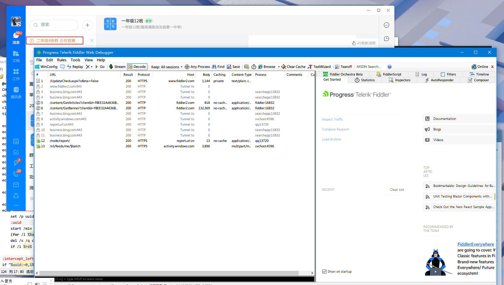
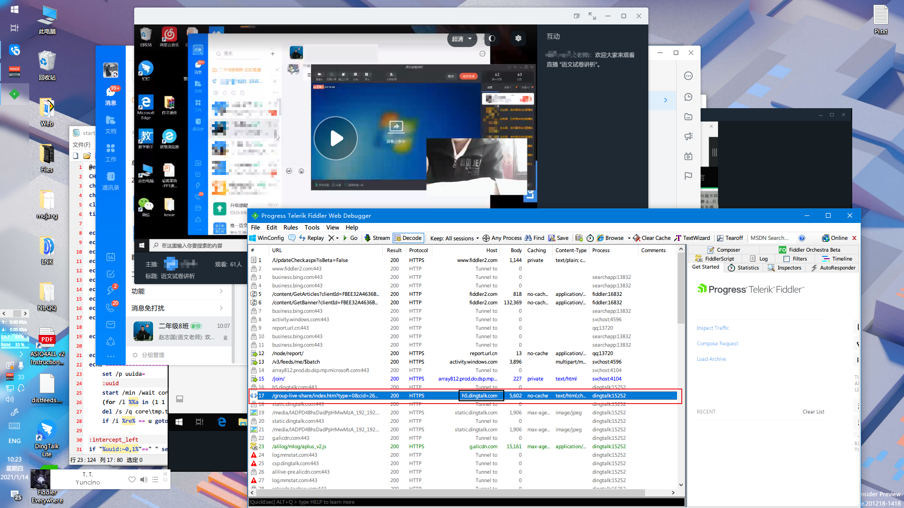
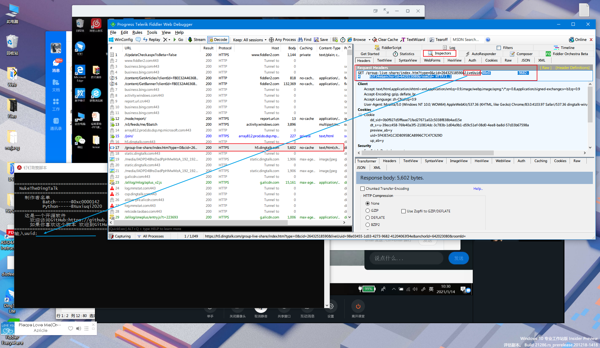

# NukeTheDingTalk
*亲爱的钉钉我们又来了*
## 1.介绍
NukeTheDingTalk是一个2021传新版本钉钉可用的刷赞脚本

 就酱
 
 ## 2.用法
 
 1--->从 [release](https://github.com/0xcFFFF142/NukeTheDingTalk/releases/latest) 下载最新的版本
 
 2--->下载并打开Fiddler(你自己不会下么 
 
 3--->开启Fiddler的HTTPS解密
> Tools-Options-HTTPS
>
> 勾选 Capture HTTPS CONNECTs
>
> 勾选 Decrypt HTTPS traffic

 
 3--->打开钉钉 找到一个可怜的直播准备开刷
 
 4--->获取UUID
 

## FAQ -- 常见问题解答

Q:我GitHub图片加载不出来

A:请使用coding镜像 [Click Here](https://fxc0000142.coding.net/public/NukeTheDingtalk/NukeTheDingTalk/git/)
  
Q:UUID抓不到怎么办

A:使劲抓(你不告诉我详细问题我上哪告诉你解答

Q:Fiddler里面没有`h5.dingtalk.com`肿么办

A: 
+ 请检查Fiddler的Https解密是否正常开启

+ 请检查Fiddler的代理配置是否正常

+ 请检查钉钉是否使用了浏览器代理(系统代理

 > 诊断钉钉是否使用了系统代理
 >
 > 在钉钉里面打开直播看Fiddler有没有刷出dingtalk.exe的HTTP或HTTPS

Q:为什么Android端的钉钉到21.4亿会闪退?

A:超过了int的最大值就会这样 --- int的最大值是`2,147,483,647`.

Q:为什么直播结束显示0赞

A:超过了int的最大值就会这样 --- int的最大值是`2,147,483,647`.

A:当赞的数量超过了int的最大值时,会变成负的int(就是`-2,147,483,647`

Q:这么多都跟int有关,int究竟是啥

A:我觉得[这个](http://www.acesheep.com/src/helpyou/?int)很适合你

A:另外,建议你看看这些: [第一个](web/1.md)  [第二个](web/2.md)
